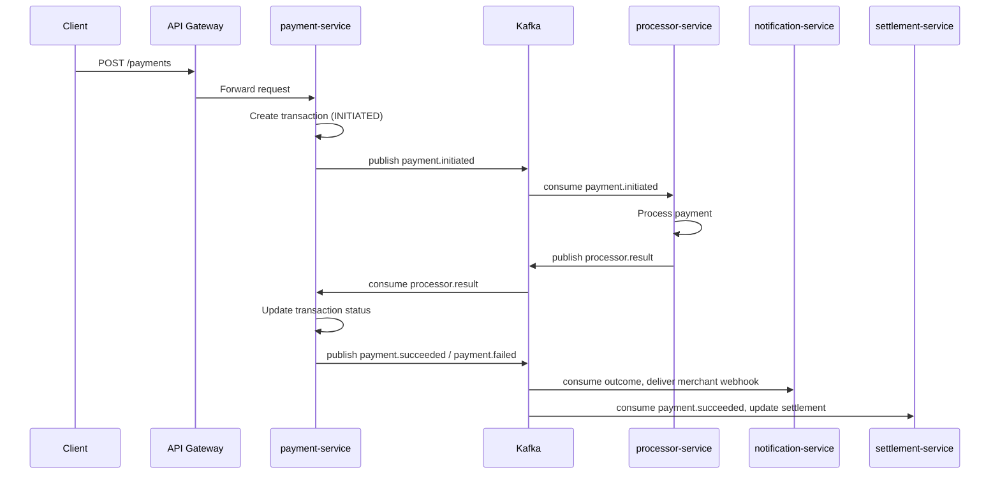

# Payment Gateway

A microservices-based payment gateway platform supporting merchant onboarding, payment processing, settlements, and webhook notifications.

## Services

| Service | Responsibility |
|---|---|
| `api-gateway-service` | Single entry point; API-key authentication, request routing |
| `merchant-service` | Merchant onboarding, API key management |
| `payment-service` | Payment initiation, transaction lifecycle |
| `processor-service` | Payment processing against the payment processor |
| `settlement-service` | Daily settlement aggregation, CSV report export to S3 |
| `notification-service` | Merchant webhook delivery on payment outcomes |
| `common` | Shared DTOs, events, and exceptions used across services |

## Tech Stack

- Java 21, Spring Boot 3.4.1
- Spring Data JPA + MySQL (database-per-service)
- Apache Kafka (event-driven inter-service communication)
- Flyway (schema migrations)
- AWS S3 / LocalStack (settlement report storage)
- Docker & Docker Compose

## Architecture

Services communicate asynchronously via Kafka for payment lifecycle events (initiation, processing results, success/failure) and synchronously via the API Gateway for client-facing requests. Each service owns its own database.

### Kafka Topics

| Topic | Producer | Consumer(s) | Purpose |
|---|---|---|---|
| `payment.initiated` | payment-service | processor-service | Trigger processing of a new payment |
| `processor.result` | processor-service | payment-service | Report processing outcome back to payment-service |
| `payment.succeeded` | payment-service | notification-service, settlement-service | Notify merchant + record for settlement |
| `payment.failed` | payment-service | notification-service | Notify merchant of failure |
| `payment.timed_out` | payment-service | notification-service | Notify merchant of timeout |
| `merchant.created` | merchant-service | — | Emitted on merchant registration |
| `merchant.suspended` | merchant-service | — | Emitted on merchant suspension |

### Event Flow



## Design Highlights

- **Database-per-service** — each service owns its schema exclusively; no cross-service DB access.
- **Idempotency** — payment and settlement writes are protected by DB-level unique constraints (`merchant_id` + `idempotency_key`, `merchant_id` + `settlement_date` + `currency`), guarding against duplicate processing from client retries or Kafka redelivery.
- **API Gateway as single entry point** — internal services aren't exposed publicly; all client traffic is authenticated at the gateway via API key.
- **Schema migrations via Flyway** — versioned, testable SQL migrations per service instead of relying on Hibernate auto-DDL.

## Getting Started

### Prerequisites
- Java 21, Maven
- Docker & Docker Compose
- MySQL running locally (one database per service)

### Run

```bash
mvn clean package -DskipTests
docker-compose up --build
```

The API Gateway is available at `http://localhost:8080`.

## Project Structure

```
.
├── api-gateway-service/
├── common/
├── merchant-service/
├── payment-service/
├── processor-service/
├── settlement-service/
├── notification-service/
├── docker-compose.yml
└── pom.xml
```